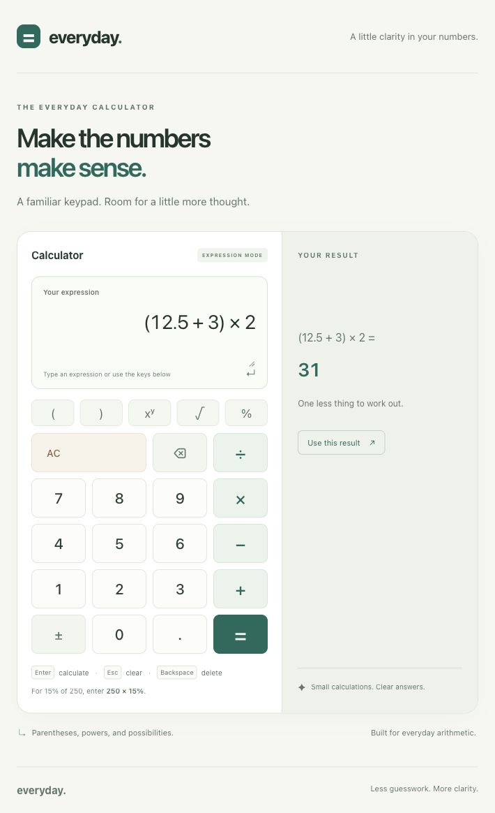

# Everyday Calculator

A small full-stack calculator with a React/TypeScript frontend and a Go REST service. All arithmetic runs on the backend. The responsive UI supports keyboard input, field validation, loading states, request cancellation, and readable errors. A desktop-style keypad edits a text expression, including parentheses and operator precedence.



[Mobile preview](reports/screenshots/calculator-mobile.jpg)

## Requirements

- Node.js **22 LTS** recommended (minimum 20.19)
- npm (use the committed `package-lock.json`)
- Go **1.26**
- Docker, only for the optional container workflow

## Run locally

Clone this repository, then install the frontend dependencies:

```sh
cd frontend
npm ci
```

In one terminal, start the backend from the repository root:

```sh
cd backend
go run ./cmd/server
```

In a second terminal, start the frontend from the repository root:

```sh
cd frontend
npm run dev
```

Open **http://localhost:5173**. The API listens on port **8080**. Vite proxies `/api` requests to the backend, so browser requests use the same origin. Both processes must be running; a connection error appears if the backend is unavailable.

The backend accepts `-addr` to change its listen address. If you change its port during development, update `server.proxy` in `frontend/vite.config.ts` accordingly.

## Production build

The Go service can also serve the built frontend, giving both layers a single origin:

```sh
# From the repository root
npm --prefix frontend run build
go -C backend build -o calculator ./cmd/server
./backend/calculator -static-dir ./frontend/dist
```

Open **http://localhost:8080**. `npm run preview` previews the frontend build only; use the Go command above to test the full stack.

### Docker (optional)

```sh
docker build -t everyday-calculator .
docker run --rm -p 8080:8080 everyday-calculator
```

Open **http://localhost:8080**. The multi-stage image builds both layers and runs the Go binary with static assets as a non-root user. Docker has not yet been validated in this restricted development environment.

## Calculator controls

- Type directly into **Your expression**, or use the digit, decimal-point, operator, and function buttons.
- Buttons insert at the caret and replace selected text. The square-root button inserts `sqrt()` with the caret inside, or wraps selected text.
- **Enter** or **=** calculates; **Shift+Enter** inserts a newline; **Escape** or **AC** clears; **Backspace** deletes a character or selection.
- **±** negates the whole expression. **Use this result** copies the exact backend number into the editor.
- **Copy result** writes the displayed number to the clipboard without thousands separators or the approximation symbol, so it can be pasted back into an expression. A confirmation appears after copying; if the clipboard is unavailable or denied, the UI suggests manual copying.
- **≈** appears only when the displayed number is rounded from the backend value. Display normally uses 15 significant digits; near the `float64` limit it preserves the original finite value if rounding would overflow. Copying uses the displayed value; **Use this result** and keypad continuation keep the full backend precision.
- After a result, a keypad operator continues from that result; a digit starts a new expression. Direct typing edits the existing expression.
- For b% of a, enter `a * b%`, e.g. `250 × 15%` returns `37.5`.

## API

### Evaluate an expression

`POST /api/v1/evaluate` with `Content-Type: application/json`:

```sh
curl http://localhost:8080/api/v1/evaluate \
  -H 'Content-Type: application/json' \
  -d '{"expression":"(12.5 + 3) × 2"}'
# {"result":31}
```

The frontend uses this endpoint. The single-operation endpoint below remains available for existing API consumers.

| Expression | Result | Rule |
| --- | --- | --- |
| `2 + 3 * 4` | `14` | Multiplication before addition |
| `(2 + 3) * 4` | `20` | Parentheses first |
| `2^3^2` | `512` | Powers associate to the right |
| `-2^2` | `-4` | Powers before unary signs |
| `(-2)^2` | `4` | Explicit grouping |
| `2^-2` | `0.25` | Negative exponents |
| `sqrt(9) + √(16)` | `7` | Square roots require parentheses |
| `250 * 15%` | `37.5` | Postfix percent divides by 100 |
| `200 + 10%` | `200.1` | Percent is a ratio; it does not infer a base amount |
| `200 * (1 + 10%)` | `220` | Explicit 10% increase |

Supported literals are decimal/scientific numbers (e.g. `.5`, `2.`, `1e-3`). Operators are `+`, `-`/`−`, `*`/`×`, `/`/`÷`, `^`, and postfix `%`; parentheses and `sqrt(...)`/`√(...)` are supported. Implicit multiplication (`2(3)`), named constants, other functions, and executable code are rejected.

Precedence from strongest to weakest: postfix percentage, powers, unary signs, multiplication/division, addition/subtraction. Non-power binary operators associate to the left. Whitespace/newlines are allowed. Expressions are limited to **512 characters** and **64 levels of parser recursion**. No `eval` or user-code execution is used.

Syntax errors return HTTP 400 with a specific error code, a descriptive message, and a **one-based Unicode character position**. Empty, long, and deeply nested expressions use `EMPTY_EXPRESSION`, `EXPRESSION_TOO_LONG`, and `EXPRESSION_TOO_COMPLEX`. Arithmetic/domain errors use HTTP 422 as below. The UI shows the message/location and highlights the reported position in the submitted expression.

```json
{"error":{"code":"UNEXPECTED_OPERATOR","message":"Operator '*' cannot appear here. Enter a value first.","position":3}}
```

| Syntax error code | Example | Meaning |
| --- | --- | --- |
| `MISSING_OPERAND` | `2+` | An operator needs another value |
| `MISSING_OPERATOR` | `2(3)` | Values require an explicit operator |
| `UNEXPECTED_OPERATOR` | `2**3` | An operator appears where a value is needed |
| `EMPTY_PARENTHESES` | `sqrt()` | A group/function has no argument |
| `MISSING_CLOSING_PARENTHESIS` | `(2+3` | A group is not closed |
| `UNEXPECTED_CLOSING_PARENTHESIS` | `2+3)` | A closing parenthesis has no matching opening |
| `INVALID_NUMBER` | `1..2`, `1e+` | Invalid decimal/scientific literal |
| `UNSUPPORTED_FUNCTION` | `sin(9)` | Only square root is supported |
| `FUNCTION_PARENTHESES_REQUIRED` | `sqrt 9` | Function arguments need parentheses |
| `UNSUPPORTED_CHARACTER` | `2@3` | Unsupported character |

### Frontend editing and cleanup

Keyboard, paste, and keypad edits use the same `ExpressionPolicy`, built on a reusable `InputPolicy`. Unsupported characters/functions are rejected without changing the existing expression. A rejected paste is discarded entirely rather than joining digits (`1a2` never becomes `12`); the previous selection is restored. Partial `sqrt` prefixes and scientific notation remain editable, and deletion remains available for incomplete function names.

Cleanup runs only on **Calculate / Enter**, then updates the textarea and sends exactly that expression to the API:

When cleanup changes parentheses, incomplete function names, or trailing operators, a brief **Expression updated** notice explains each correction. It clears on a valid edit, reset, or a subsequent submission that needs no corrections. Whitespace-only trimming does not produce a correction notice.

| Entered expression | Submitted expression |
| --- | --- |
| `2*(3+4*5` | `2*(3+4*5)` — missing closings are appended at the very end |
| `2+3))` | `2+3` — unmatched closings are removed |
| `2+3+` | `2+3` — trailing binary operators are removed |
| `2+(` | `2` — empty opening parentheses at the end are removed before trailing operators |
| `2+sqr` | `2` — trailing `s`, `sq`, or `sqr` function prefixes are removed |
| `2+(sq` | `2` — cleanup repeats until the unfinished suffix is removed |
| `2*(3+4+` | `2*(3+4)` — trailing operator cleanup precedes completion |
| `((2+3))*4` | `(2+3)*4` — redundant nested wrappers are collapsed |
| `sqrt(((9)))` | `sqrt(9)` — function parentheses are preserved |

Meaningful grouping, percentage suffixes, unary signs, and exponent signs are preserved (`(2+3)*4`, `15%`, `2^-3`, `1e-3`). Only unfinished names at the end are removed; `2+sq+3`, the complete name `sqrt` without an argument, and explicitly empty `sqrt()` still produce backend errors. Cleanup does not invent missing operands inside groups or repair invalid numbers: `(2+)`, `1..2`, and `1e+` remain errors. If cleanup leaves no expression, the UI asks for input without calling the API. Completion is checked against the length limit before sending. Direct API callers receive strict validation; the backend does not silently repair formulas.


### Calculate

`POST /api/v1/calculate` with `Content-Type: application/json`:

```sh
curl -i http://localhost:8080/api/v1/calculate \
  -H 'Content-Type: application/json' \
  -d '{"operation":"divide","operands":[10,2]}'
```

```json
{"result":5}
```

| Operation | Operands | Meaning |
| --- | --- | --- |
| `add` | `[a,b]` | a + b |
| `subtract` | `[a,b]` | a − b |
| `multiply` | `[a,b]` | a × b |
| `divide` | `[a,b]` | a ÷ b |
| `power` | `[a,b]` | a raised to b |
| `sqrt` | `[a]` | Non-negative square root of a |
| `percentage` | `[a,b]` | **b% of a**, calculated as a × (b ÷ 100) |

Percentage example:

```sh
curl http://localhost:8080/api/v1/calculate \
  -H 'Content-Type: application/json' \
  -d '{"operation":"percentage","operands":[250,15]}'
# {"result":37.5}
```

Square root example:

```sh
curl http://localhost:8080/api/v1/calculate \
  -H 'Content-Type: application/json' \
  -d '{"operation":"sqrt","operands":[81]}'
# {"result":9}
```

Error example (HTTP 422):

```sh
curl -i http://localhost:8080/api/v1/calculate \
  -H 'Content-Type: application/json' \
  -d '{"operation":"divide","operands":[10,0]}'
```

```json
{"error":{"code":"DIVISION_BY_ZERO","message":"Cannot divide by zero."}}
```

| HTTP status | Error codes / condition |
| --- | --- |
| `400` | `INVALID_JSON`, `INVALID_OPERANDS`, `UNKNOWN_OPERATION` |
| `404` | `NOT_FOUND` for unknown API endpoints |
| `405` | `METHOD_NOT_ALLOWED`, with an `Allow` header |
| `413` | `REQUEST_TOO_LARGE` (body limit: 4096 bytes) |
| `415` | `UNSUPPORTED_MEDIA_TYPE` |
| `422` | `DIVISION_BY_ZERO`, `DOMAIN_ERROR`, `RESULT_OUT_OF_RANGE` |

The API rejects missing/extra operands, null/string/boolean operands, unknown fields, multiple JSON documents, and non-finite numeric values. Domain errors include negative square roots and negative bases with fractional exponents. Error messages are suitable for display; clients can use the stable error codes for programmatic handling.

### Health

```sh
curl http://localhost:8080/api/v1/health
# {"status":"ok"}
```

## Tests and coverage

Run both layers using `make test`, or individually:

```sh
go -C backend test -race ./...
npm --prefix frontend test
```

Run `make check` for TypeScript/production build validation, frontend formatting, Go vet, and Go formatting checks. Run `make coverage` to run tests, generate HTML reports, and refresh the committed [coverage snapshot](reports/coverage.md).

The frontend uses Prettier with two-space indentation, single quotes, semicolons, and a 100-character print width. Format frontend files with `npm --prefix frontend run format`; verify their style without rewriting files with `npm --prefix frontend run format:check`. CI runs the same formatting check through `make check`.

Equivalent individual coverage commands:

```sh
go -C backend test -race -coverprofile=coverage.out ./...
go -C backend tool cover -html=coverage.out -o coverage.html
npm --prefix frontend run test:coverage
node scripts/update-coverage.mjs
```

Detailed reports are generated at `backend/coverage.html` and `frontend/coverage/index.html`. The compact machine-readable snapshots are committed under `reports/`. The frontend enforces minimum 85% line/statement/function and 80% branch coverage. The report script enforces minimum 85% coverage for each Go domain/API package. Go's server entry point is included in the overall coverage total and reported separately rather than hidden.

Tests cover arithmetic, numeric boundaries, JSON/HTTP contracts, static serving, UI validation, Enter submission, backend errors, retries, timeouts, cancellation, and stale-response handling. UI tests mock the network boundary; HTTP tests exercise the real arithmetic implementation via `httptest`. These are not a substitute for a live browser smoke test.

**Current validation:** 183 frontend tests and the Go test suite with the race detector passed, together with TypeScript, frontend formatting, production frontend compilation, and Go vet. Frontend coverage is 100% for statements, lines, and functions, and 98.28% for branches; backend overall statement coverage is 92.39%, including the untested server entry point. See the [coverage snapshot](reports/coverage.md) for package-level details. A live check against the Go API confirmed display and clipboard copying at both `±Number.MAX_VALUE` boundaries ([screenshot](reports/screenshots/calculator-finite-boundary.jpg)). Docker and hosted CI execution remain unverified. Earlier development and browser-validation records are in [PROMPTS.md](PROMPTS.md).

GitHub Actions is configured to run the checks and tests on pushes and pull requests, regenerate coverage, and upload the reports as build artifacts.

## Design decisions and assumptions

- **Small scope:** the screen evaluates one arithmetic expression per request. A dependency-free Pratt parser in Go handles precedence, grouping, unary signs, and postfix percentages. The original single-operation endpoint remains compatible. No database, login, routing library, global state library, or stored calculation history is needed.
- **Explicit boundaries:** the Go `calculator` package knows arithmetic and domain errors; `httpapi` owns decoding, HTTP statuses, and JSON. The React API client owns transport and response validation; the screen owns input and presentation state.
- **Backend authority:** the UI checks blank input and bounds expression length; the server owns grammar validation, number finiteness, and all arithmetic/domain rules. The frontend only edits expression text and displays backend results.
- **Real numbers and `float64`:** results follow IEEE 754 arithmetic, including normal rounding and underflow to zero. This is a general calculator, not a currency/decimal-precision service. For example, the API may return `0.30000000000000004` for 0.1 + 0.2; the UI normally displays up to 15 significant digits for readability, preserving the original value if rounding would overflow. Arithmetic overflow and non-real results return an error. Negative zero is displayed as zero.
- **Powers:** negative exponents and fractional exponents of non-negative bases are supported. Negative bases require an integer exponent. `0^0` is defined as `1`, matching Go's `math.Pow`; zero to a negative power is rejected.
- **Percentage:** the single-operation API operand order is amount, then percentage. Percentages may be negative or exceed 100. Dividing the percentage first avoids a common intermediate-overflow case; extreme subnormal inputs retain `float64` underflow limitations.
- **Input:** expression literals accept decimal and scientific notation, with `.` as the decimal separator. Commas, hexadecimal, NaN, and infinity are rejected. The on-screen keypad provides digits, decimal points, signs, and parentheses on mobile.
- **Request lifecycle:** inputs are disabled while an operation is pending; duplicate submissions are prevented. A request times out after 10 seconds. Reset cancels it, and a late response cannot replace the next calculation. Editing input clears the previous result.
- **Same-origin deployment:** development uses Vite's proxy; production uses the Go static-file handler. No permissive CORS policy is needed. The API has a request body limit and server timeouts; the process handles interrupt/termination with graceful shutdown.
- **No unnecessary dependencies:** Go uses the standard library. React uses native fetch and local component state. Styling is plain CSS with system fonts, keyboard focus states, labeled inputs, and live result announcements.

## Repository layout

```text
backend/
  cmd/server/          Server configuration and lifecycle
  internal/calculator/ Arithmetic, expression parser, and domain tests
  internal/apperror/   Common structured application errors and contract tests
  internal/httpapi/    Route registration and HTTP contract tests
    calculate.go      Single-operation handler and operand validation
    evaluate.go       Expression handler and domain-error status mapping
    request.go        Bounded JSON decoding and request validation
    response.go       Shared JSON/error responses
frontend/
  src/App.tsx          Application entry component
  src/App.test.tsx     Calculator integration tests through the app
  src/components/
    feedback/         Reusable structured error display and clipboard button
    layout/           Shared page header/footer and colocated CSS
  src/pages/
    calculator/
      CalculatorPage.tsx  Page composition
      CalculatorPage.css  Page-specific layout and responsive styles
      components/     ExpressionInput, Keypad, CalculatorKey, ResultPanel + CSS
      hooks/          useCalculator: editing, focus, and request lifecycle
      model/          Pure editing/display helpers, types, and unit tests
  src/services/       Calculator API, JSON HTTP transport, and client tests
  src/errors/         AppError base class and error conversion
  src/input/          Reusable rule-based InputPolicy
  src/styles/         Global defaults shared by pages
reports/               Coverage snapshot and raw data
scripts/               Coverage snapshot generator
PROMPTS.md             AI prompts and development transparency
```

Each page owns its components, hooks, model helpers, and styles. Shared layout and transport code live outside the page directory. `CalculatorPage` connects the components to `useCalculator`; components receive values and callbacks through typed props. Text-input keyboard handlers stay with `ExpressionInput`, caret-preserving button behavior stays with `CalculatorKey`, and calculation requests/cleanup stay in the hook. Arithmetic remains on the backend.

The HTTP transport handles fetch, cancellation propagation, and JSON decoding. The calculator API service validates its response contract and converts backend errors into `CalculatorApiError`. Go endpoint handlers decode inputs, call the domain, and map results/errors to HTTP responses; shared request/response functions handle media types, body limits, JSON validation, and headers. Existing routes and response formats remain compatible.

## Expression parser validation

The expression parser has table-driven tests for precedence, nested parentheses, unary signs, right-associative powers, scientific notation, percentages, domain failures, and input/depth limits. A fuzz test additionally checks that arbitrary input does not panic or return a successful non-finite result:

```sh
go -C backend test ./internal/calculator -run='^$' -fuzz=FuzzEvaluate -fuzztime=5s -parallel=2
```

Frontend component tests cover insertion at the cursor, replacing selected text, square-root wrapping, keyboard shortcuts, clearing, backspace, exact-result reuse, copying, cancellation, stale responses, and display/copy behavior at `±Number.MAX_VALUE`. Backend tests assert exact zero for underflow and other zero-valued results.

## AI assistance

This implementation was developed with Codex. The assignment permits AI tools and asks for the prompts used; see [PROMPTS.md](PROMPTS.md) for the supplied brief, clarified requirements, workflow, and validation limitations.
